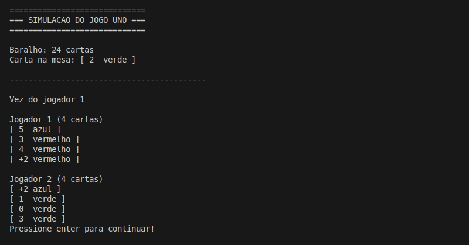

# UNO

Codigo que simula uma partida de UNO entre dois jogadores com 24 cartas. As cartas sendo de 0 a 5 e das cores: vermelho, azul e verde, mais 3 cartas +2 de cada cor e o mesmo para carta reverso.

- Nesse código é implementada a estrutura de dados Pilha com conceitos de recursividade e manipulação de String em C

